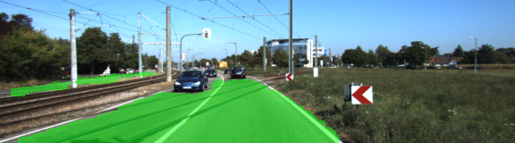

### Goal:

Goal of this project was to utilize Fully Convolutional Network based on the VGG-16 Image Classifier Architecture. This would allow us to perform semantic segmentation to identify drivable road areas from KITTI's dataset.

### Architecture:

A pre-trained VGG-16 NN (Encoder) was altered by changing the Fully Connected Layer to a Fully Convolutional Network(Decoder). Fully Convolutional Networks take advantage of 3 special techniques:

* Replacing fully connected layers w/ 1x1 convolutional layers. Instead of flattening 2D, tensor will remain 4D.
* Upsampling through the use of transposed convolutional layers
* Skip connections. Skip Connections are key because they allow the network to use information fm multiple resolution scales allowing us to make more precise segmentation decisions.

### Optimizer:

Majority of these items came from the Project Walkthrough. Understandably, cross entropy is our loss function. Also, AdamOptimizer is used because it uses moving averages of the parameters, in other words, momentum. This enables us to use a larger effective step size and the algorithm will converve to this step size w/o fine tuning.

### Hypaparameters

Majority of these items came from the Project Walkthrough.

* keep_prob: 0.5
* learning_rate: 0.001 # 0.0009
* epochs: 50 # 6 | 12 | 15 (0.009) | 25
* batch_size: 5

### Results
****
To train the model, I used the AMI that was provided earlier in class. It definitely accelerated the training. For instance, training w/ 6 epochs on my Macbook took about 2 hours while running it on the AMI took about 15 - 20 minutes.

* Epochs: 6  ------>  Loss: 0.103, Learning Rate: 0.009

* Epochs: 12 ------>  Loss: 0.068, Learning Rate: 0.009
* Epochs: 25 ------>  Loss: 0.073, Learning Rate: 0.009
	* @ Epoch 15 ------> Loss: 0.032 
* Epochs: 15 ------>  Loss: 0.039, Learning Rate: 0.001
	* Run: runs/1511327363.53094
* Epochs: 50 ------>  Loss: 0.022, Learning Rate: 0.001
	* Run: runs/1511339463.387004

